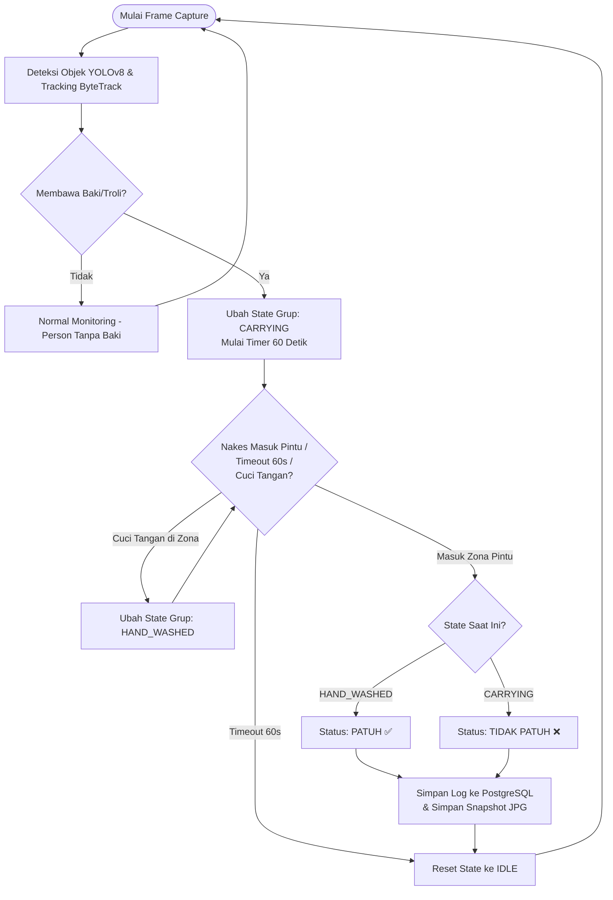
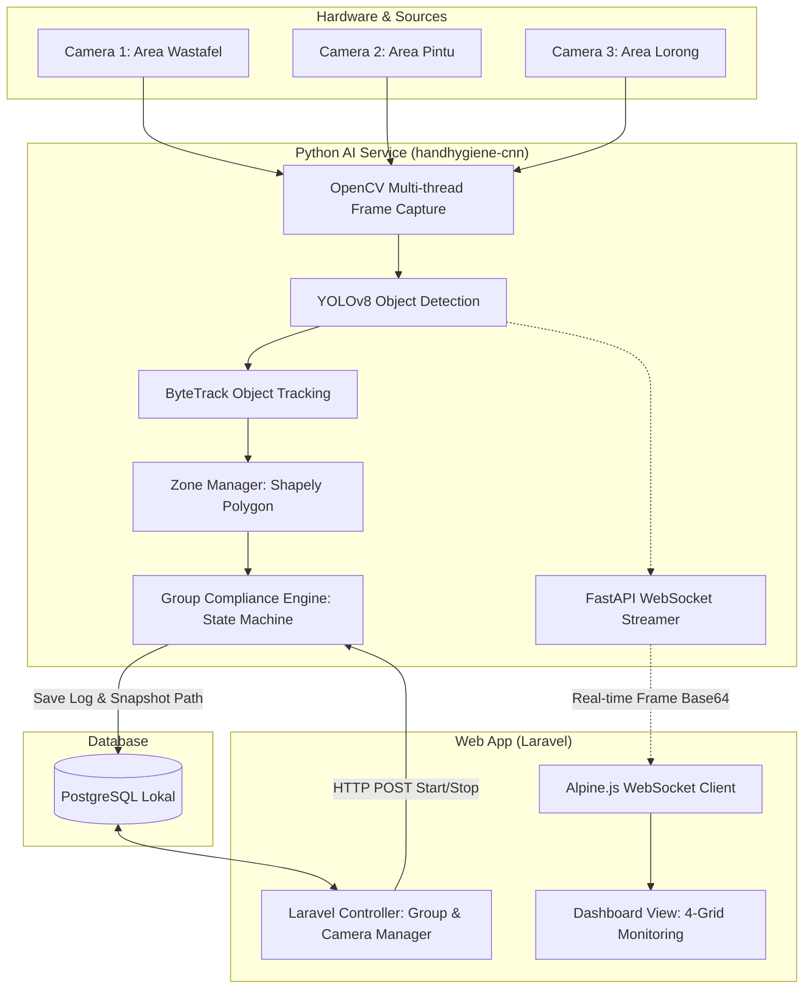

# Sistem Monitoring Kepatuhan Cuci Tangan — Implementation Plan

Sistem berbasis Computer Vision (YOLOv8) untuk memantau kepatuhan cuci tangan tenaga kesehatan secara real-time menggunakan multi-kamera, tracking objek, logika zona, dan penyimpanan ke PostgreSQL, dengan arsitektur **Grup Monitoring (Cross-Camera)** dan dashboard web berbasis Laravel.

---

## 🧠 Kerangka Berpikir Sistem (Conceptual Framework)

Kerangka berpikir dalam pengembangan sistem monitoring kepatuhan ini didasarkan pada hubungan sebab-akibat (kausalitas) tindakan tenaga kesehatan (Nakes) yang dimonitor oleh Computer Vision secara real-time. Hubungan terstruktur tersebut dijabarkan melalui bagan **Input - Proses - Output**:

### 1. Input (Masukan)
*   **Video Feed (Multi-Camera)**: RTSP IP Camera, USB Webcam, atau file video mentah yang merekam lorong/ruangan.
*   **Konfigurasi Spasial (Zona)**: Koordinat polygon zona `Sanitizer`/`Wastafel` dan zona `Pintu Masuk` yang dikonfigurasi per kamera.
*   **Dataset Kustom**: Image-label pasangan koordinat objek target (`tenaga_kesehatan`, `baki_medis`, `troli_medis`, `wastafel`, `hand_sanitizer`, `pintu_masuk`).

### 2. Proses (Inference & State Logic)
*   **Deteksi Objek (YOLOv8)**: Mengidentifikasi objek tenaga kesehatan dan objek instrumen medis (baki/troli) serta zona target.
*   **Pelacakan Objek (ByteTrack)**: Melacak pergerakan tenaga kesehatan agar log kepatuhan dapat dihubungkan ke ID yang konsisten selama berada dalam cakupan kamera.
*   **Deteksi Zona (Shapely)**: Menguji apakah koordinat kaki tenaga kesehatan berpotongan (*intersect*) dengan koordinat polygon zona.
*   **Mesin Kepatuhan Grup (Group Compliance Engine)**:
    *   **Logika Temporal**: Menerapkan window waktu 60 detik untuk mendeteksi rangkaian kejadian.
    *   **State Machine Lintas-Kamera**: Menggabungkan deteksi dari berbagai kamera dalam satu grup (lorong) tanpa bergantung pada Re-ID wajah/biometrik.

### 3. Output (Keluaran)
*   **Status Kepatuhan**:
    *   **PATUH (Compliant)**: Terdeteksi membawa baki/troli -> terdeteksi di zona sanitizer/wastafel melakukan cuci tangan -> masuk zona pintu.
    *   **TIDAK PATUH (Non-Compliant)**: Terdeteksi membawa baki/troli -> masuk zona pintu tanpa cuci tangan.
*   **Database Record**: Menyimpan ID grup, ID kamera, status kepatuhan, timestamp, dan path snapshot ke tabel `monitoring_logs` PostgreSQL.
*   **Visual Evidence**: File snapshot berformat `.jpg` dengan bounding box terarsir yang tersimpan secara lokal dan dapat ditampilkan di Dashboard Laravel.
*   **Live Stream Dashboard**: Video stream real-time dengan overlay bounding box yang terkirim melalui WebSocket.

---

## 📊 Diagram Alur & Arsitektur

### 1. Diagram Alur Logika Kepatuhan (Group Compliance Logic Flowchart)



### 2. Diagram Arsitektur Multi-Service (System Architecture)



---

## 🖥️ Konsep Grup Monitoring (Cross-Camera)

Karena jangkauan satu kamera CCTV di lapangan sering kali terbatas, sistem menggunakan konsep **Grup Monitoring**.
- Satu **Grup** mewakili satu area/lorong.
- Kamera-kamera di dalam grup yang sama bekerja sama mendeteksi kepatuhan.
- **Syarat Grup**: Harus terdapat minimal 1 zona **Pintu Masuk** dan 1 zona **Cuci Tangan (Sanitizer/Wastafel)** di antara seluruh kamera di grup tersebut (tidak harus berada pada satu kamera yang sama).
- **Logika Spasial-Temporal**: Jika Kamera A mendeteksi perawat membawa instrumen, lalu Kamera B mendeteksi cuci tangan, lalu Kamera C mendeteksi orang masuk pintu dalam jeda waktu tertentu (window 60 detik), maka sistem menyimpulkan status sebagai **PATUH**.

---

## 📁 Struktur Folder Proyek

```
e:\skripsi\sistem\
├── laravel-app/                # Web Dashboard (PHP/Laravel)
│   ├── app/
│   │   ├── Models/             # MonitoringGroup, Camera, Zone, MonitoringLog
│   │   └── Http/Controllers/   # GroupController, CameraController, DashboardController
│   ├── routes/web.php          # Definisi route Laravel
│   ├── resources/views/        # Blade templates (Dashboard, Group, Kamera, Laporan)
│   └── database/migrations/    # Skema PostgreSQL
│
├── handhygiene-cnn/            # AI Service (Python/FastAPI)
│   ├── main.py                 # FastAPI app entry point
│   ├── config.py               # Konfigurasi AI (Confidence, Timeout, dsb)
│   ├── api/                    # REST Endpoint untuk Laravel (groups.py, cameras.py)
│   ├── core/
│   │   ├── detector.py         # YOLO wrapper
│   │   ├── tracker.py          # ByteTrack integration
│   │   ├── zone_manager.py     # Polygon zone logic (Shapely)
│   │   ├── group_compliance.py # State machine kepatuhan per GRUP
│   │   └── camera_manager.py   # Multi-camera thread manager
│   ├── utils/                  # Koneksi DB (psycopg2) & save snapshot
│   └── snapshots/              # Penyimpanan foto hasil deteksi
│
├── dataset/                    # Dataset unified untuk training
│   ├── images/
│   ├── labels/
│   └── data.yaml
│
├── training/
│   ├── train.py                # Script training YOLOv8
│   └── prepare_dataset.py      # Merge & prepare semua dataset
│
├── models/                     # Model YOLO tersimpan (best.pt)
├── docker-compose.yml          # PostgreSQL + pgAdmin (opsional)
├── requirements.txt            # Python dependencies
└── README.md
```

---

## ⚙️ Rincian Komponen Teknis

### 1. Model Database Utama (PostgreSQL)

*   **`monitoring_groups`**: `id`, `nama_grup`, `deskripsi`, `lokasi`, `aktif`
*   **`cameras`**: `id`, `group_id`, `nama_kamera`, `tipe`, `source`, `aktif`, `zona_config`
*   **`zones`**: `id`, `group_id`, `camera_id`, `nama_zona`, `tipe_zona`, `polygon_points`
*   **`monitoring_logs`**: `id`, `person_id`, `group_id`, `camera_id`, `status`, `waktu`, `snapshot_path`

### 2. Dataset Yang Digunakan & Skema Kelas

| Dataset | Jumlah Train | Kelas | Kegunaan |
|---|---|---|---|
| `hand sanitizer detection` | 426 gambar | `Sanitizer` | Deteksi hand sanitizer |
| `hand-washing` | 3.890 gambar | `step_1` s/d `step_6` | Deteksi aktivitas mencuci tangan |
| `tray_dataset_raw` | ~328 gambar | `baki_medis` | Deteksi baki medis (setelah dianotasi) |

#### `dataset/data.yaml`
```yaml
nc: 6
names:
  0: tenaga_kesehatan
  1: baki_medis
  2: troli_medis
  3: wastafel
  4: hand_sanitizer
  5: pintu_masuk
```

---

## 📋 Urutan Implementasi (Tahapan)

| Tahap | Komponen | Status |
|---|---|---|
| **1** | Setup Database & Relasi (Grup, Kamera, Zona, Log) | Selesai ✅ |
| **2** | Backend Laravel: CRUD Models, Controllers, Routes | Selesai ✅ |
| **3** | Frontend Laravel: Views (Dashboard, Manajemen Grup) | Selesai ✅ |
| **4** | AI Service Python: Detector, Tracker, ZoneManager | Selesai ✅ |
| **5** | AI Service Python: Group Compliance Engine | Selesai ✅ |
| **6** | Integrasi API: WebSocket & Start/Stop Grup Lintas-Service | Selesai ✅ |
| **7** | Training Model: Dataset Prep & YOLO Fine-tuning | Belum Dimulai ❌ |
| **8** | Evaluasi & Pengujian Keseluruhan | Belum Dimulai ❌ |

---

## 🧪 Verification Plan

### 1. Automated / Unit Test
*   **API Service Test**: Validasi endpoint FastAPI menggunakan Http client.
*   **Compliance Logic Test**: Memasukkan event dummy (bounding box buatan) ke `GroupComplianceEngine` untuk memvalidasi state transition `CARRYING` -> `HAND_WASHED` -> `PATUH`/`TIDAK PATUH`.

### 2. Manual Verification
*   **Camera Integration**: Menguji input feed dari Webcam USB atau file video melalui Dashboard Laravel.
*   **Zone Configuration**: Memastikan poligon zona yang digambar di dashboard tersimpan dan ter-load di AI Service secara akurat.
*   **Skenario Patuh**: Mensimulasikan Nakes membawa baki -> berhenti di zona sanitizer (cuci tangan) -> masuk pintu. Log terdaftar "PATUH" dengan snapshot yang valid.
*   **Skenario Tidak Patuh**: Mensimulasikan Nakes membawa baki -> langsung masuk pintu tanpa cuci tangan. Log terdaftar "TIDAK PATUH" dengan snapshot yang valid.
